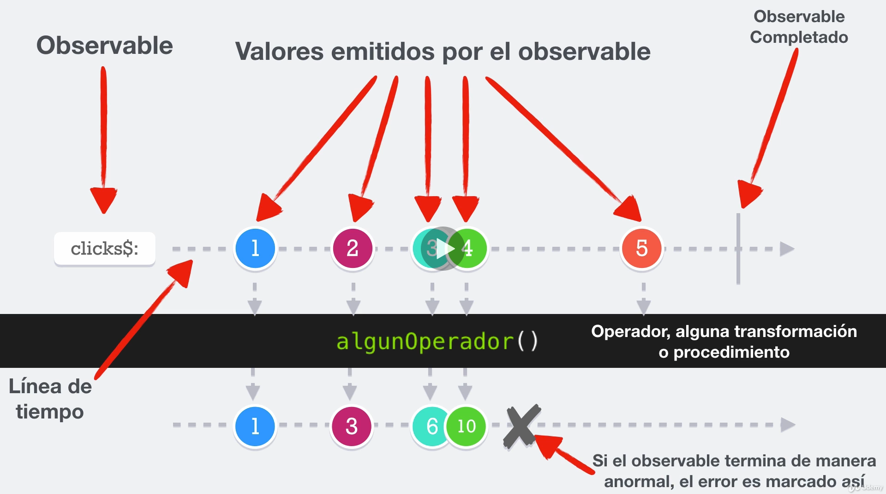

# ReactiveX

## Conceptos fundamentales

- Observables:
  - Son la fuente de información.
  - Pueden emitir ninguno, uno o varios valores.
  - Pueden emitir errores.
  - Pueden ser infinitos, finitos.
  - Pueden ser síncronos o asíncronos.
- Subscribers:
  - Se subscribgen a un observable, es decir, estan pendientes de lo que realiza el observable.
  - Consumen/ observan la información del observable.
  - Pueden recibir los errores y eventos del observable.
  - Desconocen todo lo que se encuentra detrás del observable.
- Operators:
  - Transforman Observables (map, group, scan...).
  - Filtran observables (filter, distinct, skip, debounce...).
  - Combinan observables.
  - Pueden crear nuevos observables.

## Patrones de diseño usados

- Observer: define ina dependecia del tipo uno a muchos entre objetos, de manera que cuando uno de los objetos cambia su estado, notifica este cambio a todos los dependientes.
- Iterator: define una interfaz que declara los métodos necesarios para accceder secuencialmente a un grupo de objetos de una colección.
- Programación funcional: conjunto de funciones que tengan un objeto especifico, sin efectos secundario ni modificar los datos.

## Diagramas de canicas

Son los diagramas usado en la documentación oficial de ReactiveX.

## Funciones de Subscribers

- `next()`: emite un dato.
- `complete()`: finaliza la emisión de datos. Si llamamos a la función `next()`, no funcionará

## Funcionamiento de prueba de los concepto

- Ejecutar `npm install` nada más clonar el repositorio para instalar las dependecias.
- Copiar el contenido del fichero que queramos probar dentro de `index.ts`.
- Ejecutamos el comando `npm run start`
